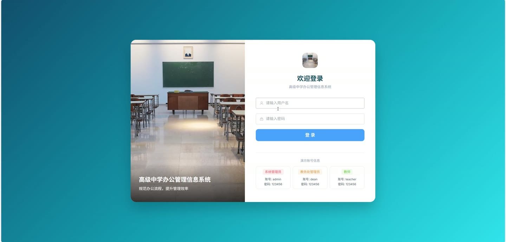
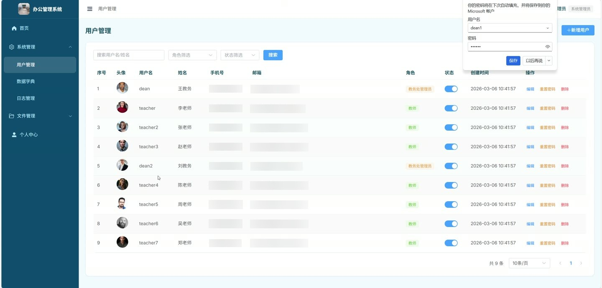
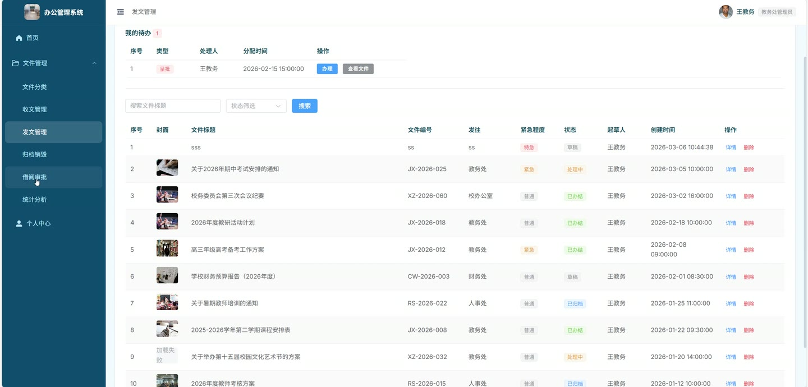
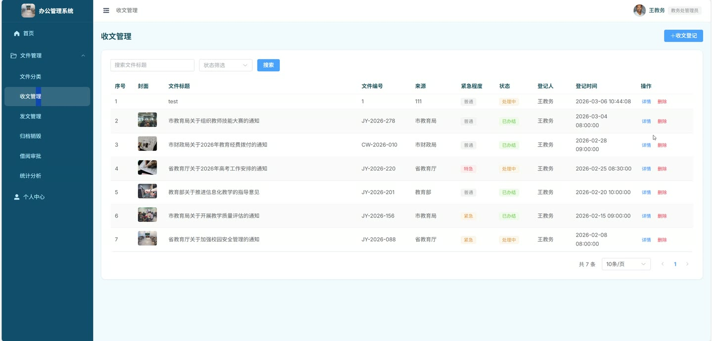
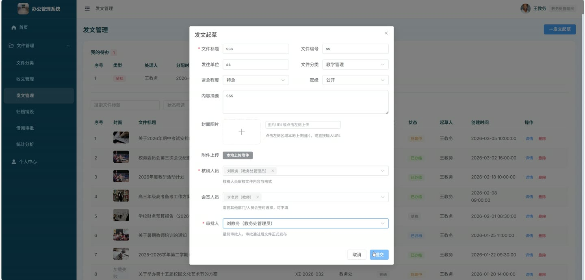
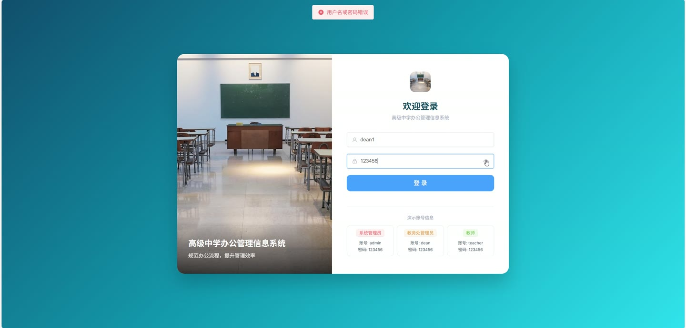

# (附文档)Springboot3+Vue3 高级中学办公管理信息系统

**技术栈**：Springboot3、Vue3

### 系统简介

本系统是一套基于 Spring Boot 3 + Vue 3 前后端分离架构的高级中学办公管理信息系统，实现了公文收发、流程审批、档案管理、借阅管理、用户权限等核心办公功能。系统内置系统管理员、教务处管理员、教师三种角色，覆盖文件从起草/登记、核稿、会签、呈批、办结到归档/销毁的全生命周期管理。
 
### 核心功能
 
### 系统管理员

 
- 用户管理：分页查询用户列表（支持按姓名/用户名、角色、状态搜索），创建/编辑/删除用户，切换用户启用/禁用状态，重置用户密码为 123456 
- 修改密码：用户登录后通过原密码验证修改个人密码 
- 更新个人信息：编辑个人真实姓名、手机号、邮箱、头像等资料 
- 数据字典管理：分页查询字典列表（支持按字典类型、标签关键词搜索），创建/编辑/删除字典条目，按字典类型编码获取启用状态的字典列表 
- 系统日志查询：分页查询操作日志与异常日志（支持按日志类型、关键词、日期范围筛选） 
- 文件分类管理：查看分类树结构（支持无限级父子层级），创建/编辑/删除分类（删除时校验是否存在子分类） 
- 仪表盘统计：查看全系统文件总数、用户总数、收文/发文数量、借阅中数量、已归档数量、处理中数量，以及文件状态分布饼图数据 
- 文件管理：分页查询所有文件列表（支持按标题关键词、文件类型、状态、分类筛选），查看文件详情（含流转记录），删除文件（校验是否有未办理的流转记录） 
- 文件归档/销毁：分页查询归档/销毁记录（支持按操作类型、档号关键词搜索），执行归档操作（仅已办结文件可归档），执行销毁操作 
- 文件借阅管理：分页查询所有借阅记录（支持按状态、借阅人筛选），审批借阅申请（通过/驳回并填写审批意见），登记文件归还
 
### 教务处管理员

 
- 仪表盘：查看自己创建的文件总数、收文/发文数量、处理中/已归档数量，以及个人文件状态分布饼图 
- 收文登记：填写文件标题、文号、分类、来源、紧急程度、密级、摘要、附件等信息，选择阅办人（可多人），提交后自动创建阅办流程，文件状态变为处理中 
- 发文起草：填写文件基本信息，选择核稿人（可多人）、会签人（可选）、呈批人，提交后自动创建核稿→会签→呈批串行流程，文件状态变为处理中 
- 文件管理：查看自己创建的文件列表（支持按关键词、类型、状态、分类搜索），编辑文件，删除文件（校验有无未办理的流转记录） 
- 文件详情：查看文件完整信息及所有流转记录（含核稿、会签、呈批各步骤的处理人、状态、意见、处理时间） 
- 文件流转处理：在待办列表中查看需要自己处理的核稿/会签/审批任务，执行通过或退回操作（退回后文件状态恢复为草稿） 
- 文件借阅管理：查看自己创建文件的借阅统计（总借阅次数、各状态数量），支持按日期范围筛选 
- 文件归档/销毁：对自己创建的文件执行归档（仅已办结文件）或销毁操作 
- 文件统计分析：按日期范围统计自己创建文件的收文/发文数量及各状态数量
 
### 教师

 
- 仪表盘：查看个人待办数量、当前借阅中数量、总借阅次数、已处理文件数量 
- 待办列表：查看分配给自己的所有待处理任务（包括阅办、核稿、会签、审批等），显示文件标题、流程类型、创建时间 
- 文件处理：对待办任务执行通过或退回操作，填写处理意见，系统自动更新流程状态并判断文件是否全部办结 
- 我的处理记录：分页查询个人所有处理记录（支持按关键词、流程类型、状态搜索），显示文件标题、文号、文件类型、处理结果 
- 文件列表：查看分配给自己处理的所有文件（通过流转记录关联），支持按关键词、类型、状态搜索 
- 文件详情：查看文件完整信息及所有流转记录 
- 文件借阅：提交借阅申请（选择文件、填写借阅原因、预计归还时间），查看个人借阅记录（支持按状态筛选），归还已借阅文件 
- 修改密码：通过原密码验证修改个人密码 
- 更新个人信息：编辑个人资料
 
### 技术栈

 后端框架Spring Boot 3.x ORMMyBatis-Plus 权限认证JWT（jjwt）+ Spring Security（PasswordEncoder） 前端框架Vue 3 状态管理Pinia 构建工具Vite 数据库MySQL 日志记录自定义操作日志注解 + AOP 切面 文件上传本地文件存储（按日期分目录）
 
### 交付内容

 
- 后端完整源码 
- 前端完整源码 
- 数据库初始化脚本 
- 万字文档

## 界面展示

---

## 获取完整源码 + 万字文档

本仓库为项目介绍页。**完整前后端源码、数据库初始化脚本、万字项目文档**，请访问 [codekk.top](http://codekk.top) 获取。

可作课程设计 / 毕业设计参考，支持远程部署调试。